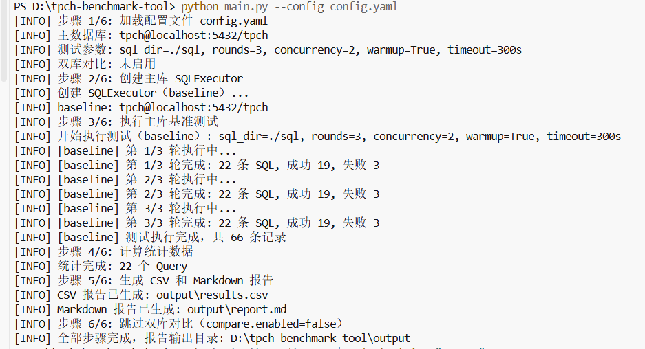
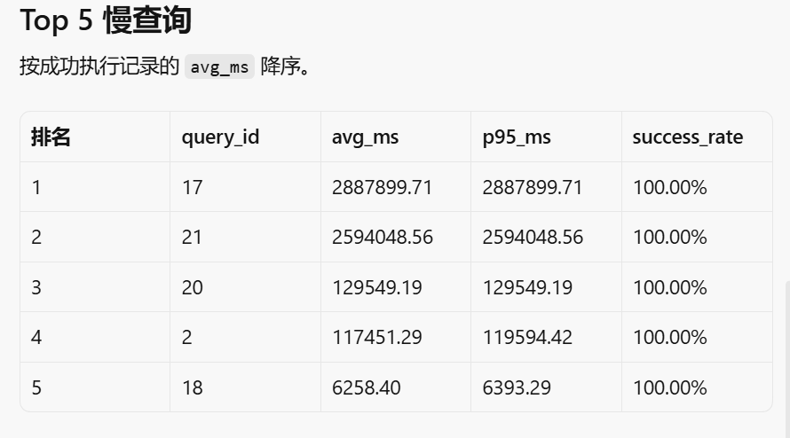
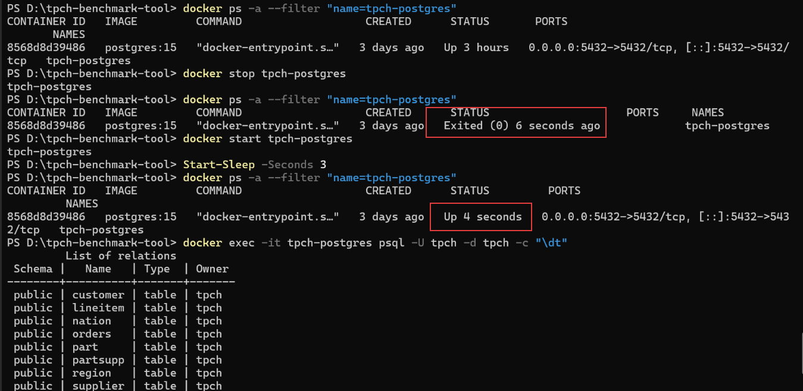
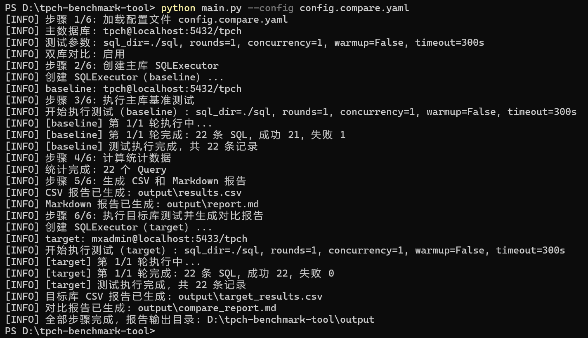

# TPC-H Benchmark 工具 - 设计决策与验证记录

## 1. 本次作业的核心目标

做一个现场 PoC 能用的最小闭环：用配置文件驱动 TPC-H 查询执行，把每条 SQL 的耗时和成败记下来，自动汇总 avg / min / max / p95 / 成功率，并产出客户能打开的 CSV 和 Markdown。

它要回答的问题不是「我能不能手写 22 条 SQL」，而是：

- 同一套查询在当前库上哪些慢、慢多少、有没有失败
- 失败是超时、连接断开还是 SQL 本身报错
- 如果以后接上 YMatrix 或竞品，能否用同一工具做公平对比

本次实际完成：PostgreSQL 15 + SF=1 主库测试，以及 MatrixDB 4.8.12 Docker demo 的一轮同 SQL 对比。**没有**「YMatrix 全面更快」或「已验证 5.2.1」这类结论。

## 2. 我做了哪些关键判断

### 判断 1：选第 5 题，而不是 Flink / OPC UA / 迁移工具

| 项目 | 内容 |
| ---- | ---- |
| 我选择了什么 | 第 5 题：TPC-H / TPC-C 测试执行与结果汇总工具 |
| 为什么这么选 | FDE 日常最高频的工作之一就是性能测试和竞品对比。这题依赖最少：有数据库和 SQL 就能跑出可演示闭环，一周内能验证，而不是把风险押在集群能否启动上。 |
| 放弃了什么 | 题目 1（Flink 写入）、题目 4（OPC UA 接入）、题目 3（MySQL 迁移校验） |
| 放弃理由 | 1 / 4 需要额外中间件，任一组件起不来作业就交不出去；题目 3 更偏类型映射和 checksum，对「现场讲性能」帮助不如 Benchmark 直观。 |

### 判断 2：配置用 YAML，会话参数写进配置而不是写死在代码里

| 项目 | 内容 |
| ---- | ---- |
| 我选择了什么 | `config.yaml` + `session_params`（连接后 `SET work_mem` 等） |
| 为什么这么选 | 现场改轮数、超时、并发、工作内存是 DBA 的日常操作。YAML 比一长串 CLI 更好保存和复用；会话参数单独列出，对应题目要求的「不同数据库参数设置」，也避免把调优写死在 executor 里。 |
| 放弃了什么 | 纯 JSON 配置；把所有参数做成 argparse；在 SQL 文件头部写 `SET` |
| 放弃理由 | JSON 对非开发人员不友好；纯 CLI 无法版本化一份「当时到底怎么测的」；SQL 内嵌 `SET` 会污染标准 TPC-H 文本，换库对比时不容易对齐。 |

### 判断 3：超时先用 300s 暴露问题，再用 timeout=0 补测，而不是删掉慢查询

| 项目 | 内容 |
| ---- | ---- |
| 我选择了什么 | 自动化阶段 `timeout=300`；对 TIMEOUT 的 Q17 / Q20 / Q21 改为不限时补测，把真实毫秒数写进报告 |
| 为什么这么选 | 300s 能快速标出哪些 SQL 是瓶颈；但报告如果只写 TIMEOUT，客户仍然不知道「到底要跑多久」。补测拿到 Q17 = 2887899.71 ms、Q21 = 2594048.56 ms、Q20 = 129549.19 ms，才有调优基线。 |
| 放弃了什么 | 一直维持 300s 并在报告里把这三条标成失败；从目录中删除 Q17/Q20/Q21 |
| 放弃理由 | 前者报告不完整；后者不符合 TPC-H 22 条集合，也会让工具看起来在回避难点。 |

### 判断 4：自动化阶段允许 concurrency=2，解释结果时按「资源会互相影响」来读，而不是把 2 当成默认最佳实践

| 项目 | 内容 |
| ---- | ---- |
| 我选择了什么 | 工具支持 `ThreadPoolExecutor` 并发；本次自动化实测 `concurrency=2`。CSV 时间戳显示 Q1 与 Q2 几乎同时开始，说明它们确实并行。 |
| 为什么这么选 | 题目要求支持并发数。实现上每线程独立连接，避免共享 cursor。现场若要测「单条 SQL 的干净耗时」，应把 `concurrency` 设为 1；若要测「混合负载」，再提高并发。 |
| 放弃了什么 | 进程级 multiprocessing；默认写死并发=1 并去掉配置项 |
| 放弃理由 | SQL 执行是等待数据库的 I/O，线程足够；去掉并发配置则不满足题目，也无法在同一工具里切换两种测法。 |

## 3. 我验证过的场景

### 3.1 正常场景：功能闭环跑通

**测试配置**

- 数据库：PostgreSQL 15（Docker 容器 `tpch-postgres`）
- 数据：TPC-H SF=1
- 自动化：22 条 SQL，3 轮，并发 2，超时 300s
- 补测：Q17 / Q20 / Q21 不限时（psql 单独执行）

**运行命令**

```bash
python main.py --config config.yaml
```

**验证结果**

- 19 条 Query（Q1–Q16、Q18、Q19、Q22）各 3 次成功，CSV 与汇总表一致
- Q17 补测成功：2887899.71 ms（≈ 48.1 min）
- Q21 补测成功：2594048.56 ms（≈ 43.2 min）。CSV 中该行的起止时间按耗时反推写入；耗时本身来自补测。
- Q20 补测成功：129549.19 ms（≈ 2.16 min）。在已有索引 `idx_lineitem_combo (l_partkey, l_suppkey, l_shipdate)` 下用 psql `\timing` 测得；CSV 起止时间按耗时反推。
- 工具写出 `results/pg_multirun_results.csv`（60 行明细）和 `results/pg_multirun_report.md`

**Top 5 慢查询**

| 排名 | query_id | avg_ms | p95_ms | success_rate |
| ---- | -------- | ------ | ------ | ------------ |
| 1 | 17 | 2887899.71 | 2887899.71 | 100.00% |
| 2 | 21 | 2594048.56 | 2594048.56 | 100.00% |
| 3 | 20 | 129549.19 | 129549.19 | 100.00% |
| 4 | 2 | 117451.29 | 119594.42 | 100.00% |
| 5 | 18 | 6258.40 | 6393.29 | 100.00% |

**截图**

终端拍于目录重构之前，日志里的路径是 `output/`；当前代码写出 `results/`。该次日志为 `warmup=True`、每轮 19 成功 / 3 TIMEOUT，与补测后的 Top 5 不矛盾。



Top 5 以 `results/pg_multirun_report.md` 为准（Q17 → Q21 → Q20 → Q2 → Q18），不要对照被对比运行覆盖后的 `results/report.md`。



**结论**

配置加载、SQL 发现、执行计时、统计和报告生成是通的。工具能标出单机 PostgreSQL 上的长尾查询。YMatrix 对比是另一次实验，见 3.5 节。

### 3.2 异常场景：数据库容器未启动

**现象**

电脑重启后 `tpch-postgres` 处于 `Exited`，直接跑工具时 SQL 全部失败，`error_message` 为连接错误，程序不崩溃，最终仍写出报告（成功率为 0）。

**处理**

1. `docker ps -a` 确认容器存在但已退出
2. `docker start tpch-postgres`
3. `docker exec -it tpch-postgres psql -U tpch -d tpch -c "\dt"` 确认表还在
4. 重新执行 `python main.py --config config.yaml`

**对应代码行为**

`executor` 对单条 SQL 捕获异常并继续；`main.py` 只在「配置文件不存在、SQL 目录不存在」等流程级错误时以退出码 1 结束。

**截图**



### 3.3 异常场景：Q17 / Q21 超时

**现象**

`timeout=300` 时 Q17、Q20、Q21 的 `error_message` 为 `TIMEOUT`（PostgreSQL `statement_timeout` 取消语句）。

**处理**

1. 保留自动化结果，作为「300s 内完不成」的证据
2. 将超时改为 0，对 Q17、Q20、Q21 单独执行
3. 把真实耗时写入报告和 CSV

| 查询 | 真实耗时 | 约合 |
| ---- | -------- | ---- |
| Q17 | 2887899.71 ms | 48.1 min |
| Q21 | 2594048.56 ms | 43.2 min |
| Q20 | 129549.19 ms | 2.16 min |

**结论**

超时不是实现失败，而是基线的一部分。Q17 / Q21 在单机上仍然极慢；Q20 在已有 `idx_lineitem_combo` 下补测为 129549.19 ms。要比较 YMatrix，必须用同一超时策略或同一套不限时规则。

### 3.4 边界条件：停电导致 Q20 第一次补测中断

**现象**

Q20 第一次不限时补测期间停电，进程被杀掉，当时没有成功耗时。自动化阶段该查询已有 TIMEOUT 记录（约 300021.79 ms）。

**处理**

- 中断发生时不编造耗时，报告里如实写「未完成」
- 环境恢复后，用 `\d lineitem` 确认已有 `idx_lineitem_combo`，再只跑 Q20
- 补测成功：129549.19 ms（psql `\timing` 输出 129549.190）
- 不把「约 20 小时未跑完」写成与这次成功样本同一条件下的对照

**启示**

生产环境中不可控因素（断电、网络超时）时有发生。当前工具能捕获单条失败，但没有断点续跑；长查询现场应保证供电，或把结果按 query 落盘。

其他已考虑的边界：

| 边界 | 处理 |
| ---- | ---- |
| 配置文件不存在 | `FileNotFoundError`，进程退出码 1 |
| YAML 缺字段 | 回退到 `config.example.yaml` 同结构默认值 |
| SQL 目录不存在 | 执行前抛错，不静默跳过 |
| SQL 文件为空 | 该条记失败，不中断整批 |
| `timeout=0` | `statement_timeout=0`，不限制；现场必须知情 |
| 对比库未启用 | 日志写明跳过，不生成假的 compare 报告 |

### 3.5 正常场景：双库对比跑通

**配置**：`config.compare.yaml`，`rounds=1`，`concurrency=1`，`timeout=300`。

**步骤**：`python scripts/copy_tpch_to_ymatrix.py` 校验 8 张表行数一致后，`python main.py --config config.compare.yaml`。

**验证结果**

- PostgreSQL：21 成功，Q21 TIMEOUT（301163.63 ms）
- MatrixDB 4.8.12 demo：22 成功
- 可对比 21 条：target 更快 11、更慢 10；Q2 提升最大（-96.80%），Q12 回退最大（+308.96%）
- 产出 `results/target_results.csv`、`results/compare_report.md`

**截图**

同样拍于重构前，日志路径为 `output/`。可见 baseline 21 成功 / 1 失败，target 22 成功。



**结论**

对比功能可用。11/10 的分裂结果不能写成「YMatrix 全面更快」；target 是 4.8.12 Docker demo，不是 5.2.1。本轮 PostgreSQL Q17（2569 ms）不得与补测 Q17（48 min）合并宣传。

## 4. 总结

| 维度 | 状态 |
| ---- | ---- |
| 代码可运行 | 已在 PostgreSQL 15 + SF=1 跑通；19 条 × 3 轮成功，Q17/Q20/Q21 补测均成功 |
| 配置文件 | YAML，含连接、轮数、并发、预热、超时、会话参数、对比库开关 |
| 报告 | 多轮基线 `results/pg_multirun_*`；对比 `results/compare_report.md`；根目录 `report.md` 按作业模板撰写 |
| 双库对比 | 已跑：PG 15 vs MatrixDB 4.8.12 demo（11 快 / 10 慢，Q21 仅 target 成功） |
| 风险与限制 | 单轮对比、超时 300s、非 5.2.1；不写无法证明的结论 |
| TPC-C | 未做，README / 报告中已说明边界 |
| AI 使用说明 | `ai_usage.md` |
| 验证场景 | 正常：3.1 闭环、3.5 对比；异常：3.2 容器退出、3.3 超时；边界：3.4 停电中断 |
